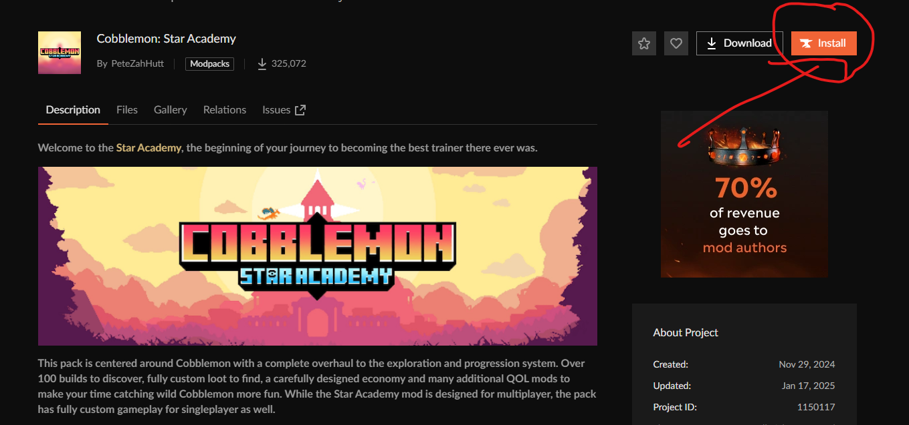
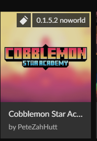

**Installation du modpack Cobblemon Star Academy**

Ce guide vous expliquera comment installer le modpack *Cobblemon Star Academy* pour jouer sur le serveur de Slayne.

---

## 🚨 Vous n'avez pas de compte Minecraft ?
👉 **Contactez-moi sur Discord** pour que je vous donne les étapes à suivre afin de jouer sans compte Minecraft.

---

## 1. Installer **CurseForge**
CurseForge est nécessaire pour télécharger et gérer le modpack.

1. Rendez-vous sur le site officiel : [Télécharger CurseForge](https://download.curseforge.com/)
2. Téléchargez et installez CurseForge selon votre système d’exploitation (Windows ou macOS).

---

## 2. Télécharger et installer le modpack

1. Ouvrez **CurseForge** et sélectionnez **Minecraft**.
2. Dans la barre de recherche, tapez **Cobblemon Star Academy** ou utilisez ce lien : [CurseForge - Cobblemon Star Academy](https://www.curseforge.com/minecraft/modpacks/cobblemon-star-academy)
3. Sélectionnez le modpack dans les résultats de recherche.
4. Cliquez sur **Installer** et attendez que le téléchargement se termine.

---

## 3. Lancer le jeu

1. Une fois l’installation terminée, cliquez sur **Jouer** via CurseForge.

   
2. Assurez-vous que votre version de Minecraft est bien **modifiée** pour inclure le modpack.

🔴 **Vous n’avez pas de compte Minecraft ?** Contactez-moi sur Discord pour que je vous donne les étapes à suivre afin de jouer sans compte.

---

## 4. Lors de la première connexion

1. Connectez-vous au serveur de Slayne en utilisant l’adresse suivante : `slayne.shulker.com`
2. Lors de votre connexion, appuyez sur la touche `*` pour ouvrir le menu du chat vocal.
3. Suivez les instructions pour sélectionner votre microphone et votre casque, sinon vous ne pourrez pas parler.

---

## 5. Sélectionner votre starter

1. Une fois connecté, vous pourrez choisir votre starter en cliquant sur la touche indiquée à gauche de votre écran.

---

🔴 **Si vous avez un problème contacter moi sur discord `Sipixer`**